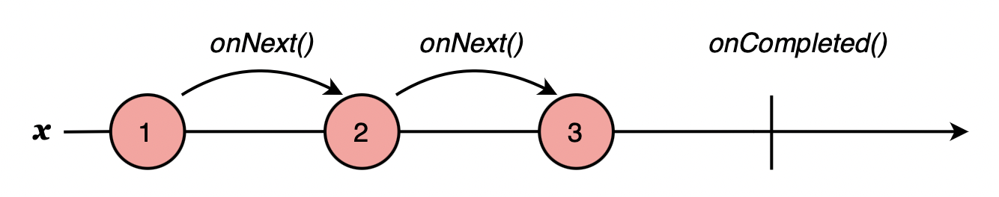
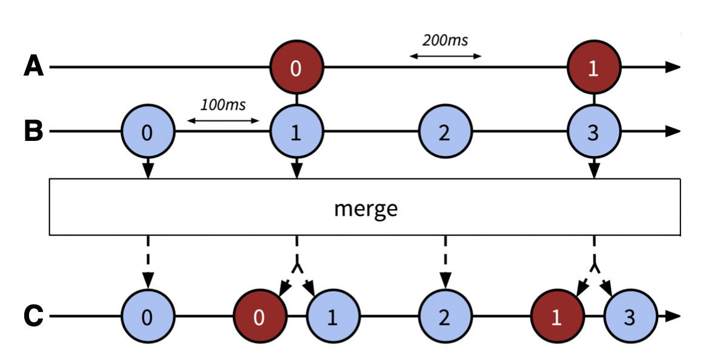
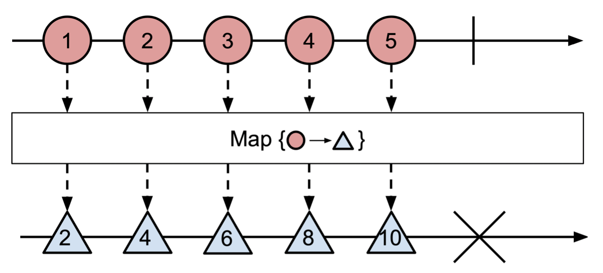
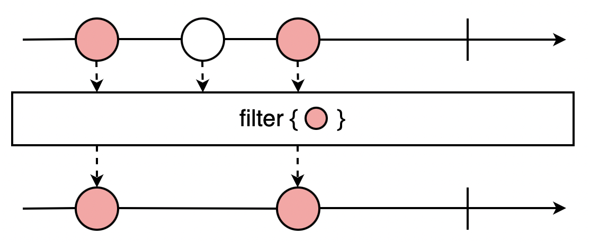
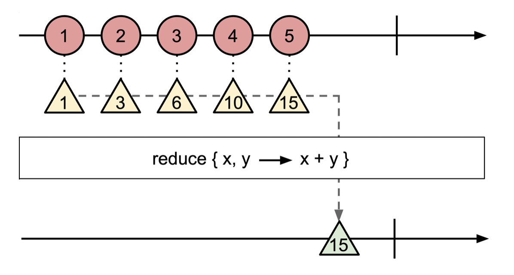
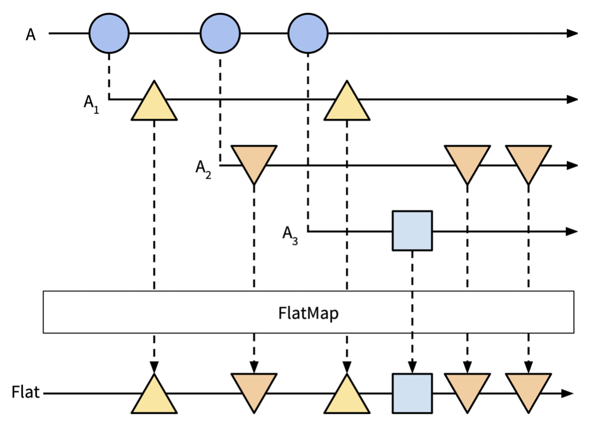
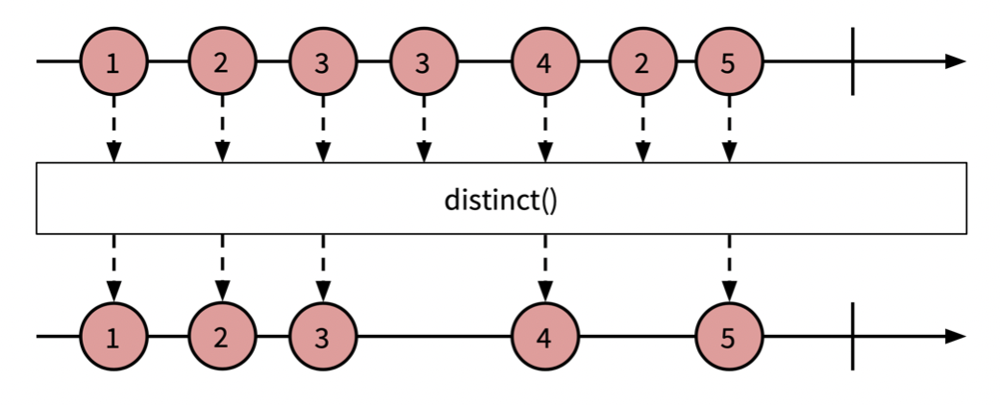

# RxJS and Reactive Programming

## What is Reactive Programming?

- Reactive programming focuses on propagating changes without us having to explicitly specify how the propagation happens.
- This allows us to state what our code should do, without having to code every step to do it. This results in a more reliable and maintainable approach to building software.

## RxJS

- RxJS is a JavaScript implementation of Reactive Extensions or Rx.
- Rx is a reactive programming model originally created at Microsoft, which allows developers to easily compose asynchronous streams of data. It provides a common interface to combine and transform data from wildly different sources, such as filesystem operations, user interaction, and social-network updates.
- Rx started with an implementation for .NET, but today it has a well-maintained, open-source implementation in every major language and also in some minor ones. It is becoming the standard to program reactive applications. Additionally, Rx’s main data type, the Observable, is being proposed for inclusion in ECMAScript 7 as an integral part of JavaScript.

## Installing RxJS in Node.js

``npm install rx``

## Querying the Sequence

Let’s implement a simple version of that mouse stream using traditional event listeners in JavaScript. To log the x- and y-coordinates of mouse clicks, we could write something like this:

```javascript
const registerClicks = e => {
  console.log(e.clientX, e.clientY);
};
document.body.addEventListener("click", registerClicks);
```

The problem, of course, is that manipulating events is not as easy as manipulating arrays. For example, if we want to change the preceding code so it logs only the first ten clicks on the right side of the screen (quite a random goal, but bear with me here), we would write something like this:

```javascript
var clicks = 0;
document.addEventListener('click', function registerClicks(e) {
      if (clicks < 10) {
            if (e.clientX > window.innerWidth / 2) {
                  console.log(e.clientX, e.clientY);
                  clicks += 1;
            }
      } else {
            document.removeEventListener('click', registerClicks);
      }
});
```

To meet our requirements, we introduced an external state through a global variable clicks that counts the clicks made so far. We also need to check for two different conditions and use nested conditional blocks. And when we’re done, we have to tidy up and unregister the event to not leak memory.

We managed to meet our easy requirements, but ended up with a complicated code for a simple goal. It’s a difficult code to maintain and not obvious for a developer who looks at it for the first time. More importantly, we made it prone to develop subtle bugs in the future because we need to keep the state.

What if we treated that stream of click events as a data source that can be queried and transformed? After all, it’s no different from a database—it is one that emits values in real-time. All we need is a data type that abstracts the concept for us.

Enter RxJS and its Observable data type:

```javascript
var Rx=require('rx');

Rx.Observable.fromEvent(document, 'click')
    .filter(c => c.clientX > window.innerWidth / 2) 
    .take(10)
    .subscribe(function(c) { 
        console.log(c.clientX, c.clientY) 
    })
```

This code reads like this:

Create an Observable of click events and filter out the clicks that happen on the left side of the screen. Then print the coordinates of only the first ten clicks to the console as they happen.

Notice how the code is easy to read even if we’re not familiar with it. Also, there’s no need to create external variables to keep state, which makes the code self-contained and makes it harder to introduce bugs. There’s no need to clean up after yourself either, so there is no chance of us introducing memory leaks by forgetting about unregistering event handlers.

In the preceding code, we created an Observable from a DOM event. An Observable provides us with a sequence or stream of events that we can manipulate as a whole instead of as a single isolated event each time. Dealing with sequences gives us enormous power. We can merge, transform, or pass around Observables easily. We’ve turned events we can’t get a handle on into a tangible data structure that’s as easy to use as an array, but much more flexible.

## Rx Pattern and Observable

Rx pattern is the combination of the Observer pattern and Iterator patterns

`Observer Pattern + Iterator Pattern = Rx Pattern`

The Observable sequence, or simply Observable, is central to the Rx pattern. An Observable emits its values in order—like an iterator—but instead of its consumers requesting the next value, the Observable “pushes” the values to consumers as they become available. It has a similar role to that of the Producer’s in the Observer pattern: emitting values and pushing them to its listeners.

`Pulling vs pushing: In programming, push-based behavior means that the server component of an application sends updates to its clients instead of the clients having to poll the server for these updates. It’s like the saying, “Don’t call us. We’ll call you.” RxJS is push-based, so the source of events, the Observable, will push new values to the consumer, the Observer, without the consumer requesting the next value.`

Put more simply, an Observable is a sequence whose items become available over time. The consumers of Observables, Observers, are the equivalent of listeners in the Observer pattern. When an Observer is subscribed to an Observable, it will receive the values in the sequence as they become available, without having to request them.

- An Observable doesn’t start streaming items until it has at least one Observer subscribed to it.

- Like Iterators, an Observable can signal when the sequence is completed.

## Creating Observables and Operators

There are several ways to create Observables, the create operator being the most obvious one. The create operator in the Rx.Observable object takes a callback that accepts an Observer as a parameter. This function defines how the Observable will emit values.

```javascript
var observable = Rx.Observable.create(function(observer) { 
    observer.onNext('Simon');
    observer.onNext('Jen');
    observer.onNext('Sergi');
    observer.onCompleted(); // We are done 
});
```

## Observers

- Observers listen to Observables. Whenever an event happens in an Observable, it calls the related method in all of its Observers.

- Observers have three methods—onNext, onCompleted, and onError:
  - onNext: This is the equivalent of the Update function in the Observer pattern. It is called when the Observable emits a new value. Notice how the name reflects the fact that we are subscribed to sequences, and not only discrete values.
  - onCompleted: This method signals that there is no more data available. After the onCompleted method is called, any further calls to the onNext method will have no effect.
  - onError: This method is called when an error occurs in the Observable. After it is called, any further calls to the onNext method will have no effect.

### create a basic Observer

```javascript
var observer = Rx.Observer.create(function onNext(x) {
    console.log('Next: ' + x);
}, function onError(err) {
    console.log('Error: ' + err);
}, function onCompleted() {
    console.log('Completed');
});
```

The create method in the Rx.Observer object takes the functions for the onNext, onCompleted, and onError cases and returns an Observer instance.

These three functions are optional, and we can decide which ones to include. For example, if we are subscribing to an infinite sequence such as clicks on a button (the user could keep clicking forever), the onCompleted handler will never be called. If we’re confident that the sequence can’t throw an error (for example, by making an Observable from an array of numbers), then we don’t need the onError method.

## Making Ajax Calls With an Observable

```javascript
function get(url) {
  return Rx.Observable.create(function(observer) {
    // Make a traditional Ajax request
    var req = new XMLHttpRequest(); 
    req.open('GET', url);
    req.onload = function() { 
      if (req.status == 200) {
        // If the status is 200, meaning there have been no problems, // Yield the result to listeners and complete the sequence observer.onNext(req.response);
        observer.onCompleted();
      } else {
        // Otherwise, signal to listeners that there has been an error
        observer.onError(new Error(req.statusText)); 
      }
    };
  req.onerror = function() {
    observer.onError(new Error("Unknown Error"));
  };
  req.send();
  });
}
// Create an Ajax Observable
var test = get('/api/contents.json');

test.subscribe(
    (data) =>  console.log('Result: ' + data),
    (err) => console.error('Error: ' + error),
    () => console.log('Completed'),
);
```

For a common operation such as an Ajax request, there is often an operator ready for us to use. In this case, the RxJS DOM library provides several ways to create Observables from DOM-related sources. Since we’re carrying out a GET request, we can use Rx.DOM.get and our code will become this:

```javascript
Rx.DOM.get('/api/contents.json').subscribe(function onNext(data) { 
    console.log(data.response); }, 
    function onError(err) { console.error(err); }
);
```

This bit of code does exactly the same as our previous one, but we don’t have to create a wrapper around the XMLHttpRequest since it’s already there. Also notice that this time we omit the onCompleted callback because we don’t plan to react when the Observable is done. We know that it will yield only one result, and we are already using it in the onNext callback.

## Creating Observables From Javascript Data Types

### Creating Observables from arrays

- We can make any array-like object that can iterate into an Observable by using the versatile `from` operator.
- The `from` operator takes an array as a parameter and returns an Observable that emits each of its elements.

```javascript
Rx.Observable.from(['Adrià', 'Jen', 'Sergi']).subscribe(function(x) { 
    console.log('Next: ' + x); 
}, function(err) { 
    console.log('Error:', err); 
}, function() { 
    console.log('Completed'); 
});
```

### Creating Observables from JavaScript events

When we transform an event into an Observable, it becomes a first-class value that can be combined and passed around.

For example, here’s an Observable that emits the coordinates of the mouse pointer whenever it moves:

```javascript
var allMoves = Rx.Observable.fromEvent(document, 'mousemove') 

allMoves.subscribe(function(e) {
  console.log(e.clientX, e.clientY);
});
```

- Transforming an event into an Observable unleashes the event from its natural constraints.
- More importantly, we can create new Observables based on the original Observables. These new Observables are independent and can be used for different tasks:

```javascript
var movesOnTheRight = allMoves.filter(function(e) { 
    return e.clientX > window.innerWidth / 2;
});

var movesOnTheLeft = allMoves.filter(function(e) { 
    return e.clientX < window.innerWidth / 2;
});

movesOnTheRight.subscribe(function(e) { 
    console.log('Mouse is on the right:', e.clientX);
});

movesOnTheLeft.subscribe(function(e) { 
    console.log('Mouse is on the left:', e.clientX);
});
```

In the preceding code, we created two Observables from the original allMoves Observable. These specialized Observables contain only filtered items from the original one: movesOnTheRight contains mouse events that happen on the right side of the screen, and movesOnTheLeft contains mouse events that happen on the left side. Neither of them modifies the original Observable, so allMoves will keep emitting all the mouse moves.

`Observables are immutable, and every operator applied to them creates a new Observable.`

### Creating Observables from callback functions

Chances are that we will have to interact with callback-based code if we use third-party JavaScript libraries. We can transform our callbacks into Observables using the, `fromCallback` and `fromNodeCallback` functions. Node.js follows the convention of always invoking the callback function with an error argument first to signal to the callback function that there is a problem. We then use `fromNodeCallback` to create Observables specifically from Node.js-style callbacks:

```javascript
var Rx = require('rx'); // Load RxJS
var fs = require('fs'); // Load Node.js Filesystem module
// Create an Observable from the readdir method
var readdir = Rx.Observable.fromNodeCallback(fs.readdir); // Send a delayed message
var source = readdir('/Users/sergi');
var subscription = source.subscribe(function(res) { 
        console.log('List of directories: ' + res); 
    }, function(err) { 
        console.log('Error: ' + err); 
    }, function() { 
        console.log('Done!'); 
    }
);
```

In the preceding code, we made an Observable readdir out of Node.js fs.readdir method. The fs.readdir method accepts a directory path and a callback function, delayedMsg, which calls once the directory contents are retrieved.

We use the readdir method with the same arguments we pass to the original fs.readdir method, minus the callback function. This returns an Observable that will properly use onNext, onError, and onCompleted when we subscribe an Observer to it.

## Introduction to Sequencing and its Operators

Observables are just streams of events that we can transform, combine, and query. It doesn’t matter whether we’re dealing with simple Ajax callbacks or processing gigabytes of data in Node.js. The way we declare our flows is the same. Once we start to think in terms of streams, our programs become less complex.

### `range` Operator

- Returns an Observable that emits integers within a specified range.

- The first parameter indicates the starting number and the second parameter corresponds to the total count.

`Rx.Observable.range(1, 3)`

The marble diagram for it will look like this:



The long arrow represents the Observable, and the x-axis represents time. Each circle represents a value that the Observable emits by internally calling the onNext() method. After generating the third value, the range operator calls the onCompleted method, which is represented in the diagram by a vertical line.

### `merge` operator

The merge operator takes two different Observables and returns a new one with the merged values.

### `interval` operator

The interval operator returns an Observable that yields incremental numbers at a given interval of time, expressed in milliseconds.

In the following code we’ll merge two different Observables that use an interval to produce values at different intervals:

```javascript
var a = Rx.Observable.interval(200).map(function (i) {
    return 'A' + i;
});
var b = Rx.Observable.interval(100).map(function (i) {
    return 'B' + i;
});
Rx.Observable.merge(a, b).subscribe(function (x) {
    console.log(x);
});
```

The marble diagram for the merge operator will look like this:


Here, the dotted arrows along the y-axis point to the final result of the transformation applied to each element in sequences A and B. The resulting Observable is represented by C, which contains the merged elements of A and B. If elements of different Observables are emitted at the same time, the order of these elements in the merged sequence is random.

### `map` operator

The map operator is the most commonly used sequence transformation operator. It takes an Observable and a function and applies that function to each of the values in the source Observable. It returns a new Observable with the transformed values.



```javascript
var logValue = function(val) { console.log(val) };
var src = Rx.Observable.range(1, 5); 
var upper = src.map(function(name) {
return name * 2; });
upper.subscribe(logValue);
```

- src doesn’t mutate
- It could be that the function we pass to the map operator does some asynchronous computation to transform the value. In that case, the map operator would not work as expected. For these cases, it would be better to use the `flatMap` operator.

### `filter` operator

The filter operator takes an Observable and a function and tests each element in the Observable using that function. It returns an Observable sequence of all the elements for which the function returned true.



```javascript
var logValue = function(val) { console.log(val) };
var isEven = (function(val) { return val % 2 === 0; });
var src = Rx.Observable.range(1, 5); 
var even = src.filter(isEven);
even.subscribe(logValue);
```

### `reduce` operator

The reduce operator, also known as fold, takes an Observable and returns a new one that always contains a single item, which is the result of applying a function over each element. This function receives the current element and the result of the function’s previous invocation.

The reduce function has another parameter that is optional and can be used to pass a starting seed value.



The reduce operator is a powerful operator that is used to manipulate a sequence. It is, in fact, the base implementation for a whole subset of methods called aggregate operators.

## Aggregate operators

- Aggregate operators process a sequence and return a single value.

- For example, `Rx.Observable.first` takes an Observable and an optional predicate function and returns the first element that satisfies the condition in the predicate.

- Calculating the average value of a sequence is an aggregate operation as well. RxJS provides the instance operator `average`.

Implement average using reduce and map

```javascript
var avg = Rx.Observable.range(0, 5) 
    .reduce(function(prev, cur) {
        return {sum: prev.sum + cur, count: prev.count + 1};
    }, { sum: 0, count: 0 }) 
    .map(function(o) {
        return o.sum / o.count; 
    });
var subscription = avg.subscribe(function(x) { 
    console.log('Average is: ', x);
});
```

### Can we aggregate infinite Observables

Imagine we’re writing a program that gives users their average speed as they walk. Even if the user hasn’t finished walking, we need to be able to make a calculation with the speed values we know so far. We want to log the average of an infinite sequence in real-time. The problem is that if the sequence never ends, an aggregate operator like reduce will never call its Observers’ onNext operator.

Luckily for us, the RxJS team has thought of this kind of scenario and provided us with the `scan` operator, which acts like the reduce operator, but emits each intermediate result:

```javascript
var avg = Rx.Observable
    .interval(1000)
    .scan(function (prev, cur) {
        return { sum: prev.sum + cur, count: prev.count + 1 };
    }, { sum: 0, count: 0 })
    .map(function (o) {
        return o.sum / o.count;
    });
var subscription = avg.subscribe(function (x) {
    console.log(x);
});
```

The scan operator accumulates the result on each value, starting from the source. This starting value is taken either from a seed value that is passed as a parameter or the starting value of the source.

This way, we can aggregate sequences that take a long time to complete or the ones that are infinite. In the preceding example, we generated an incremental integer every second and substituted the previous reduce call for scan. We now get the average of the values generated so far, every second.

## flatMap

- What can we do if you have an Observable whose results are more Observables? Most of the time, we’d want to unify items in those nested Observables in a single sequence. That’s exactly what the flatMap operator does.

- The flatMap operator takes an Observable, A, whose elements are also Observables, and returns an Observable with the flattened values of A’s child Observables. Let’s visualize this with a graph:



We can see that each of the elements in A (A1, A2, A3) are also Observable sequences. Once we apply flatMap to A with a transformation function, we get an Observable with all the elements in the different children of A.

The `flatMap` operator is a powerful operator, but it can be harder to understand than the operators we’ve seen so far. Think of it as a `concatAll()` function for Observables. `concatAll` is a function that takes an array of arrays and returns a “flattened” single array that contains the values of all the sub-arrays, instead of the sub-arrays themselves. We can use the reduce operator to make such a function:

```javascript
const values$ = Rx.Observable.from([
  Rx.Observable.of(1, 2, 3),
  Rx.Observable.of(4, 5, 6),
  Rx.Observable.of(7, 8, 9)
]);

values$.concatAll().subscribe(v => console.log(v));
```

- The flatMap operator does the same thing, but it flattens Observables instead of arrays.

- It takes a source Observable and a function that returns a new Observable and applies that function to each element in the source Observable, like map does.
- If the process is stopped here, we would end up getting an Observable that emits Observables. However, the flatMap operator emits the values emitted by each new Observable to the main sequence, thereby, “flattening” all the Observables into one. In the end, we get a single Observable.

## Canceling Sequences

In RxJS we can cancel a running Observable. This is an advantage of RxJS over other asynchronous forms of communication, such as callbacks and promises, which can’t be directly canceled once they’re called (some promise implementations support cancellation, though).

There are two main ways we can cancel an Observable: `implicitly` and `explicitly`.

### Explicit cancellation: the Disposable

Observables themselves don’t have a method to get canceled. Instead, whenever we subscribe to an Observable, we get a `Disposable` object that represents that particular subscription. We can then call the `dispose` method in that object, and that subscription will stop receiving notifications from the Observable.

In the following example, we subscribe two Observers to the counter Observable, which emits an increasing integer every second. After two seconds, we cancel the second subscription and we can see that its output stops but the first subscriber’s output keeps going:

```javascript
    var counter = Rx.Observable.interval(1000);
    var subscription1 = counter.subscribe(function (i) {
        console.log('Subscription 1:', i);
    });
    var subscription2 = counter.subscribe(function (i) {
        console.log('Subscription 2:', i);
    });
    setTimeout(function () {
        console.log('Canceling subscription2!'); 
        subscription2.dispose();
    }, 2000);
```

### Implicit cancellation: by operator

Most of the time, operators will automatically cancel subscriptions for us. Operators, such as range or take, will cancel the subscription when the sequence finishes or when the operator conditions are met. More advanced operators such as `withLatestFrom` or `flatMapLatest` will internally create and destroy subscriptions as needed, since they handle several Observables in motion. In short, we should not worry about canceling most subscriptions ourselves.

## Observables That Wrap External APIs

When we’re using Observables that wrap external APIs that don’t provide cancellation, the Observable will still stop emitting notifications when canceled, but the underlying API will not necessarily be canceled.

For example, if we’re using an Observable that wraps a promise, the Observable will stop emitting when canceled, but the underlying promise will not be canceled.

In the following code, we attempt to cancel a subscription to an Observable that wraps a promise p and, at the same time, we set an action in the traditional way for when the promise is resolved. The promise should resolve in five seconds, but we cancel the subscription immediately after creating it:

```javascript
var p = new Promise(function (resolve, reject) {
    setTimeout(resolve, 5000);
});
p.then(function () {
    console.log('Potential side effect!');
});
var subscription = Rx.Observable.fromPromise(p)
    .subscribe(function (msg) {
        console.log('Observable resolved!');
    });
subscription.dispose();
```

If we cancel the subscription to the Observable it effectively stops it from receiving the notification. However, the then method of the promise still runs, showing that canceling the Observable doesn’t cancel the underlying promise.

It’s important to know the details of the external APIs we use in Observables. We may think we’ve canceled a sequence, but the underlying API keeps running and causes some side effects in our program. These errors can be hard to catch.

## Sequence onError Handler

### Handling errors

We can’t use the conventional try/catch mechanism in callbacks, because it is synchronous. It would run before any asynchronous code, and wouldn’t be able to catch any errors.

With callbacks, this was solved by passing the error (if any) as a parameter to the callback function. This works, but makes the code fragile.

Let’s see how we can catch errors inside Observables.

#### The onError handler

Remember when we talked about the three methods we can call on an Observer. We’re familiar with the onNext and the onCompleted method, but we haven’t yet used the onError method. The `onError` method is the key to effectively handling errors in Observable sequences.

To see how it works, we’ll write a simple function to take an array of JSON strings and return an Observable that emits the objects parsed from those strings, using JSON.parse:

```javascript
function getJSON(arr) {
    return Rx.Observable.from(arr).map(function(str) {
        var parsedJSON = JSON.parse(str);
        return parsedJSON;
    });
}

getJSON([
    '{"1": 1, "2": 2}',
    '{"success: true}', // Invalid JSON string 
    '{"enabled": true}'
]).subscribe(
    function (json) {
        console.log('Parsed JSON: ', json);
    }, 
    function (err) { // onError handler
        console.log(err.message);
    }
);
```

The Observable emits the parsed JSON for the first result, but throws an exception when trying to parse the second. The onError handler catches this and prints it out. The default behavior is that whenever an error occurs, the Observable stops emitting items, and onCompleted is not called.

## Catching Errors With the Catch Operator

So far we’ve learned how to detect an error and do something with that information, but we haven’t been able to react to it and continue with whatever we were doing. Observable instances have the `catch` operator, which allows us to react to an error in the Observable and continue with another Observable.

The catch operator takes either an Observable or a function, which receives the error as a parameter and returns another Observable. In our case, we want the Observable to emit a JSON object that contains an error property if there were errors in the original Observable:

```javascript
var caught = getJSON(['{"1": 1, "2": 2}', '{"1: 1}'])
    .catch(Rx.Observable.return({
        error: 'There was an error parsing JSON'
    }));
caught.subscribe(
    function (json) {
        console.log('Parsed JSON: ', json);
    },
    // Because we catch errors now, `onError` will not be executed
    function (e) {
        console.log('ERROR', e.message);
    }
);
```

The catch operator is useful for reacting to errors in a sequence, and it behaves much like the traditional try/catch block. In some cases, though, it is convenient to ignore an error that occurs with an item in the Observable and let the sequence continue. In those cases, we can use the retry operator.

## Retrying the Sequences

Sometimes, errors just happen and there’s not much we can do about it. For example, there could be a timeout requesting remote data because the user has a spotty Internet connection, or a remote server we are querying could crash. In these cases, it would be great if we could keep requesting the data we need until we succeed. The retry operator does exactly that:

```javascript
Rx.DOM.get('/products')
    .retry(5)
    .subscribe(
        function (xhr) {
            console.log(xhr);
        },
        function (err) {
            console.error('ERROR: ', err);
        });
```

In the preceding code, we create a function that returns an Observable. This Observable then retrieves the contents from a URL, using XMLHttpRequest. Since our connection might be a bit spotty, we will add retry(5) before subscribing to it, ensuring that in case of an error, it will try up to five times before giving up and showing an error.

There are two important things to know when using the retry operator. First, if we don’t pass any parameters, it will retry indefinitely until the sequence is finished with no errors. This is dangerous for performance if the Observable keeps producing errors. If we’re using synchronous Observables, it would have the same effect as an infinite loop.

Second, retry will always retry the whole Observable sequence again, even if some of the items didn’t error. This is important in case we’re causing any side effects when processing items, since they will be reapplied with every retry.

## Distinct operator

- `distinct` operator emits the elements that haven’t been emitted before.

- It takes a function that returns the property to check for equality.

The distinct operator is one of those extremely simple operators that saves a ton of development work. It filters out of the sequence any value that has already been emitted. That keeps us from writing time and again that error-prone boilerplate code that uses a dictionary somewhere with the emitted results, against which we compare incoming results.

The distinct operator lets us use a function that specifies the comparison method. Additionally, we can pass no arguments and it will use strict comparison to compare primitives such as numbers or strings, and run deep comparisons in case of more complex objects.



```javascript
var Rx=require('rx');
var quakes = Rx.Observable 
            .interval(5000) 
            .flatMap(function() {
              return Rx.DOM.jsonpRequest({
              url: QUAKE_URL,
              jsonpCallback: 'eqfeed_callback'
            }).retry(3);
            })
            .flatMap(function(result) {
              return Rx.Observable.from(result.response.features);
            })
            .distinct(function(quake) { 
              return quake.properties.code; 
            });
quakes.subscribe(function(quake) 
{
  var coords = quake.geometry.coordinates; 
  var size = quake.properties.mag * 10000;
  L.circle([coords[1], coords[0]], size).addTo(map);
});
```

## Introduction to Concurrent Programs

### Concurrency

Concurrency is the art of doing several things at the same time, correctly and efficiently. To accomplish this, we structure our programs to take advantage of time so that tasks run together in the most efficient way.

Examples of everyday concurrency in applications include keeping the user interface responsive while other activities are taking place, and processing hundreds of customers’ orders efficiently.

### Purity and the Observable pipeline

An `Observable pipeline` is a technique that is used to chain Observable operators and pass state between them.

An Observable pipeline is a group of operators chained together, where each one takes an Observable as input and returns an Observable as output.

```javascript
const Rx = require('rx');
Rx.Observable.from([1, 2, 3, 4, 5, 6, 7, 8])
  .filter(function(val) {
    return val % 2;
  })
  .map(function(val) {
    return val * 10;
  });
```

Pipelines are self-contained. All states flows from one operator to the next, without the need for any external variables. However, as we build our reactive programs, we may be tempted to store state outside the Observable pipeline. This forces us to keep track of the variables we set outside the pipeline, and all that bean-counting can easily lead to bugs. To avoid this, the operators in a pipeline should always use pure functions.

`Pure functions` always return the same output given the same input. It’s easier to design programs with high concurrency when we can guarantee that a function in the program can’t modify the state that other functions rely on. And that’s what pure functions give us.

`Concurrency` refers to the situation where multiple tasks may be active at the same time but only one will be executing. This is different from `parallelism` where multiple tasks will be executed at the same time, for example using multiple processors. This is shown in the figure above.

## Avoiding External State Using Observable Pipelines

### Example: Counting even ticks with a set interval

```javascript
const Rx = require('rx');
var evenTicks = 0;
function updateDistance(i) {
    if (i % 2 === 0) {
        evenTicks += 1;
    }
    return evenTicks;
}
var ticksObservable = Rx.Observable
    .interval(1000)
    .map(updateDistance)
ticksObservable.subscribe(function () {
    console.log('Subscriber 1 - evenTicks: ' + evenTicks + ' so far');
});
ticksObservable.subscribe(function() {
console.log('Subscriber 2 - evenTicks: ' + evenTicks + ' so far');
});
```

Hold on a second—the even ticks count on Subscriber 2 is completely off! It should always contain the same evenTicks count as Subscriber 1. The reason behind this is that the Observable pipeline will run once for each subscriber, increasing evenTicks twice.

Problems caused by sharing the external state are often more subtle than this example. In complex applications, opening the door to changing state outside of the pipeline leads to code becoming complicated, and bugs soon start to show up. The solution is to encapsulate as much information as we can inside the pipeline. Here’s a way we could refactor the preceding code to avoid an external state:

```javascript
const Rx = require('rx');
function updateDistance(acc, i) {
    if (i % 2 === 0) {
        acc += 1;
    }
    return acc;
}
var ticksObservable = Rx.Observable
    .interval(1000)
    .scan(updateDistance, 0);
ticksObservable.subscribe(function (evenTicks) {
    console.log('Subscriber 1 - evenTicks: ' + evenTicks + ' so far');
});
ticksObservable.subscribe(function (evenTicks) {
    console.log('Subscriber 2 - evenTicks: ' + evenTicks + ' so far');
});
```

Using scan, we avoid external state altogether. We pass the accumulated count of even ticks to updateDistance, instead of relying on an external variable to keep the accumulated value.

Most of the time we can avoid relying on an external state. Common scenarios for using it are caching values or keeping track of changing values in the program. However, as we’ll see later, these scenarios can be handled in several other ways. For example, when we need to cache values, RxJS’s `Subject` Class can help a lot, and when we need to keep track of previous states of the game, we can use methods like `Rx.Observable.scan`.

## Efficiency Through Pipelines

Chaining looks similar in Observables and in arrays; there are even methods like filter and map that are present in both types. But there’s a crucial difference:

- Array methods create a new array as a result of each operation, which is traversed entirely by the next operation.

- Observable pipelines, on the other hand, don’t create intermediate Observables and apply all operations to each element in one go. The Observable is thus traversed only once, which makes chaining Observables efficient.

```javascript
stringArray // represents an array of 1,000 strings 
    .map(function (str) {
        return str.toUpperCase();
    })
    .filter(function (str) {
        return /^[A-Z]+$/.test(str);
    })
    .forEach(function (str) {
        console.log(str);
    });
```

Let’s suppose stringArray is an array with 1,000 strings that we want to convert to uppercase and then filter out the ones that contain anything other than alphabet characters (or no letters at all). Then we want to print each string of the resulting array to the console.

This is what happens behind the scenes:

We iterate through the array and create a new array with all the items in uppercase.

We iterate through the uppercase array, creating another array with 1,000 elements.

We iterate through the filtered array and log each result to the console.

In the process of transforming the array, we’ve iterated arrays three times and created two completely new and big arrays. This is far from efficient! We shouldn’t program this way if we’re concerned about performance or we’re dealing with big sequences of items.

This is what the same operation would look like using Observables:

```javascript
stringObservable // represents an observable emitting 1,000 strings
    .map(function (str) {
        return str.toUpperCase();
    })
    .filter(function (str) {
        return /^[A-Z]+$/.test(str);
    })
    .subscribe(function (str) {
        console.log(str);
    });
```

Observable pipelines look extremely similar to array chains, but their similarities end here. In an Observable, nothing ever happens until we subscribe to it, no matter how many queries and transformations we apply to it. When we chain a transformation like map, we’re composing a single function that will operate on every item of the array once.

So, in the preceding code, this is what will happen:

- We create an uppercase function that will be applied to each item of the Observable and return an Observable that will emit these new items, whenever an Observer subscribes to it.

- We compose a filter function with the previous uppercase function, and return an Observable that will emit the new items, uppercased and filtered, but only when an Observable is subscribed to it.

- We trigger the Observable to emit items, going through all of them only once and applying the transformations we defined once per item.

With Observables, we’ll go through our list only once, and we’ll apply the transformations only if absolutely required. For example, let’s say we added a take operator to our previous example:

```javascript
stringObservable 
    .map(function(str) {
    return str.toUpperCase(); 
    })
    .filter(function(str) {
    return /^[A-Z]+$/.test(str);
    })
    .take(5) 
    .subscribe(function(str) {
    console.log(str);
    });
```

The `take` operator makes the Observable emit only the first n items we specify. In our case, n is five, so out of the thousand strings, we’ll receive only the first five. The cool part is that our code will never traverse all the items. It will only apply our transformations to the first five.

This makes the developer’s life much easier. We can rest assured that when manipulating sequences, RxJS will do only as much work as necessary. This way of operating is called lazy evaluation, and it is very common in functional languages such as Haskell and Miranda.

## Introduction to the RxJS Subject Class

A Subject is a type that implements both the Observer and Observable types. As an Observer, it can subscribe to Observables, and as an Observable, it can produce values and have Observers subscribe to it.

In some scenarios, a single Subject can do the work of a combination of Observers and Observables. For example, to make a proxy object between a data source and the Subject’s listeners, we could use this:

```javascript
const Rx = require('rx');
var subject = new Rx.Subject();
var source = Rx.Observable.interval(300)
   .map(function (v) {
      return 'Interval message #' + v;
   })
   .take(5);
source.subscribe(subject);
var subscription = subject.subscribe(
   function onNext(x) {
      console.log('onNext: ' + x);
   },
   function onError(e) {
      console.log('onError: ' + e.message);
   },
   function onCompleted() {
      console.log('onCompleted');
   });
subject.onNext('Our message #1');
subject.onNext('Our message #2');
setTimeout(function () {
   subject.onCompleted();
}, 1000);
```

In the preceding example, we create a new Subject and a source Observable that emits an integer every 300 milliseconds. Then we subscribe the Subject to the Observable. After that, we subscribe an Observer to the Subject itself. The Subject now behaves as an Observable.

Next, we make the Subject emit values of its own, message1 and message2. In the final result, we get the Subject’s own messages and then the proxied values from the source Observable. The values from the Observable come later because they are asynchronous, whereas we make the Subject’s own values immediate. Notice that even if we tell the source Observable to take the first five values, the output shows only the first three values. That’s because after one second, we call the onCompleted method on the Subject. This finishes the notifications for all subscriptions and overrides the take operator in this case.

The Subject class provides the base for creating more specialized Subjects. In fact, RxJS comes with some interesting ones: AsyncSubject, ReplaySubject, and BehaviorSubject.

### AsyncSubject of RxJS

AsyncSubject emits the last value of a sequence only if the sequence is complete. This value is then cached forever, and any Observer that subscribes after the value has been emitted will receive it right away. The AsyncSubject is convenient for asynchronous operations that return a single value, such as Ajax requests.

Let’s see a simple example of an AsyncSubject subscribing to a range:

```javascript
const Rx = require('rx');
var delayedRange = Rx.Observable.range(0, 5).delay(1000);
var subject = new Rx.AsyncSubject();
delayedRange.subscribe(subject);
subject.subscribe(
  function onNext(item) {
    console.log('Value:', item);
  },
  function onError(err) {
    console.log('Error:', err);
  },
  function onCompleted() {
    console.log('Completed.');
  }
  // Output: 
  // Value: 4
  // Completed.
);
```

In the example given above, delayedRange emits the values 0 to 4 after a delay of one second. Then we create a new AsyncSubject subject and subscribe it to the delayedRange.

This is the output:

Value: 4
Completed.
As expected, we get only the last value that the Observer emits.

Let’s now use the AsyncSubject for a more realistic scenario. We’ll use it to retrieve some remote content:

```javascript
const Rx = require('rx');
function getProducts(url) { 
  var subject;
  return Rx.Observable.create(
    function(observer) {
      if (!subject) {
        subject = new Rx.AsyncSubject(); 
        Rx.DOM.get(url).subscribe(subject);
      }
      return subject.subscribe(observer); 
    });
}
var products = getProducts('/products');
// Will trigger request and receive the response when read products.subscribe(
function onNext(result) { 
  console.log('Result 1:', result.response); 
}
function onError(error) { 
  console.log('ERROR', error); 
};
// Will receive the result immediately because it's cached
setTimeout(function() { 
  products.subscribe(
  function onNext(result) { 
    console.log('Result 2:', result.response); 
  },
  function onError(error) { 
    console.log('ERROR', error); 
  } );
}, 5000);
```

In this code, when getProducts is called with a URL, it returns an Observer that emits the result of the HTTP GET request. Here’s how it breaks down:

1. getProducts returns an Observable sequence. We create it here.

2. If we haven’t created an AsyncSubject yet, we create it and subscribe it to the Observable that Rx.DOM.Request.get(url) returns.

3. We subscribe the Observer to the AsyncSubject. Every time an Observer subscribes to the Observable, it will be subscribed to the AsyncSubject, which acts as a proxy between the Observable retrieving the URL and the Observers.

4. We create an Observable that retrieves the URL “/products” and store it in the products variable.

5. This is the first subscription and will kick off the URL retrieval and log the results when the URL is retrieved.

6. This is the second subscription, which runs five seconds after the first one. Since at that time the URL has already been retrieved, there’s no need for another network request. It will receive the result of the request immediately because it is already stored in the AsyncSubject subject.

The interesting bit is that we’re using an AsyncSubject that subscribes to the Rx.DOM.Request.get Observable. Since the AsyncSubject caches the last result, any subsequent subscription to products will receive the result right away, without causing another network request. We can use AsyncSubject whenever we expect a single result and want to hold onto it.

### Does that mean the AsyncSubject acts like a promise

The AsyncSubject represents the result of an asynchronous action, and we can use it as a substitute for a promise. The difference internally is that a promise will only ever process a single value, whereas the AsyncSubject processes all the values in a sequence, only ever emitting (and caching) the last one.

Being able to so easily simulate promises shows the flexibility of the RxJS model. Even without the AsyncSubject, it would be pretty easy to simulate a promise using Observables.

## BehaviorSubject of RxJS

When an Observer subscribes to a BehaviorSubject, it receives the last emitted value and then all the subsequent values. A BehaviorSubject requires us to provide a starting value so that all Observers always receive a value when they subscribe to a BehaviorSubject.

Suppose that we want to retrieve a remote file and print its contents on an HTML page, but we want to display some placeholder text while we wait for the contents. We can use a BehaviorSubject for this:

```js
const Rx = require('rx');
var subject = new Rx.BehaviorSubject('Waiting for content');
subject.subscribe( 
  function(result) {
    document.body.textContent = result.response || result;
  },
  function(err) {
    document.body.textContent = 'There was an error retrieving content';
  });
Rx.DOM.get('/remote/content').subscribe(subject);
```

In the code, we initialize a new BehaviorSubject with our placeholder content. Then, we subscribe to it and change the HTML body content in both onNext and onError, depending on the result.

Now the HTML body contains our placeholder text, and it will stay that way until the Subject emits a new value. Finally, we request the resource we want and we subscribe our Subject to the resulting Observer.

A BehaviorSubject guarantees that there will always be at least one value emitted because we provide a default value in its constructor. Once the BehaviorSubject completes, it won’t emit any more values, freeing the memory used by the cached value.

## ReplaySubject of RxJS

A ReplaySubject caches its values and re-emits them to any Observer that subscribes to it late. Unlike with an AsyncSubject, the sequence doesn’t need to be completed for this to happen.

```js
const Rx = require('rx');
var subject = new Rx.Subject();
subject.onNext(1);
subject.subscribe(
   function(n) { 
      console.log('Received value:', n);
   });
subject.onNext(2);
subject.onNext(3);

// 2 3
```

Now let’s try it with a ReplaySubject:

```js
var Rx=require('rx');
var subject = new Rx.ReplaySubject();
subject.onNext(1);
subject.subscribe(
    function(n) { 
        console.log('Received value:', n);
    });
subject.onNext(2);
subject.onNext(3);

// 1 2 3
```

A ReplaySubject is useful for ensuring that Observers get all the values emitted by an Observable from the start. It spares us from writing messy code that caches previous values, saving us from nasty concurrency-related bugs.

Of course, to accomplish this behaviour, the ReplaySubject caches all the values in memory. To prevent it from using too much memory, we can limit the amount of data it stores by buffer size, window of time, or by passing particular parameters to the constructor.

The first parameter that is passed to the constructor of the ReplaySubject takes a number that represents the number of values we want to buffer:

```js
const Rx = require('rx');
var subject = new Rx.ReplaySubject(2); // Buffer size of 2
subject.onNext(1);
subject.onNext(2);
subject.onNext(3);
subject.subscribe(function(n) { 
    console.log('Received value:', n);
});
// 2 3
```

The second parameter takes a number that represents the time, in milliseconds, during which we want to buffer values:

```js
const Rx = require('rx');
var subject = new Rx.ReplaySubject(null, 200); // Buffer size of 200ms
setTimeout(function() { 
  subject.onNext(1); 
}, 100); 
setTimeout(function() { 
  subject.onNext(2); 
}, 200); 
setTimeout(function() { 
  subject.onNext(3); 
}, 300); 
setTimeout(function() {
  subject.subscribe(function(n) { 
      console.log('Received value:', n);
  });
    subject.onNext(4);
}, 350);

// 2 3 4
```

In this example, we set a buffer based on time, instead of on the number of values. Our ReplaySubject caches all the values that were emitted up to 200 milliseconds ago. We emit three values, each separated by 100 milliseconds and, after 350 milliseconds we subscribe to an Observer and we emit yet another value. At the moment of the subscription, the items cached are 2 and 3. Since item 1 happened too long ago (around 250 milliseconds ago), it is no longer cached.

Subjects are a powerful tool that can save us a lot of time. They provide great solutions to common scenarios like caching and repeating. And since, at their core, they are just Observables and Observers, we don’t need to learn anything new to work with them.

## Hot and Cold Observables

A hot Observable does not produce data within itself while a cold Observable produces data inside itself.

### Hot Observables

An Observer that is subscribed to a hot Observable will receive the values that are emitted from the exact moment it subscribes to it. Every other Observer subscribed at that moment will receive the exact same values. This is similar to how JavaScript events work.

Mouse events and a stock-exchange ticker are examples of hot Observables. In both cases, the Observable emits values regardless of whether it has subscribers, and could already be producing values before any subscriber is listening.

Here’s an example of this:

```js
var onMove = Rx.Observable.fromEvent(document, 'mousemove');
var subscriber1 = onMove.subscribe(function(e) {
  console.log('Subscriber1:', e.clientX, e.clientY);
});
var subscriber2 = onMove.subscribe(function(e) {
  console.log('Subscriber2:', e.clientX, e.clientY);
});
```

In the example given above, both the subscribers receive the same values from the Observable, as they are emitted. To JavaScript programmers, this behavior may feel normal because it resembles how JavaScript events work.

Now let’s see how cold Observables work.

### Cold Observables

A cold Observable emits values only when the Observers subscribe to it.

For example, Rx.Observable.range returns a cold Observable. Every new Observer that subscribes to it will receive the whole range:

```js
var Rx = require('rx');
function printValue(value) {
  console.log(value);
}
var rangeToFive = Rx.Observable.range(1, 5);
var obs1 = rangeToFive.subscribe(printValue); // 1, 2, 3, 4, 5
var obs2 = Rx.Observable
  .just() // Creates an empty Observable 
  .delay(2000)
  .flatMap(function() {
    return rangeToFive.subscribe(printValue); // 1, 2, 3, 4, 5 
  });
```
